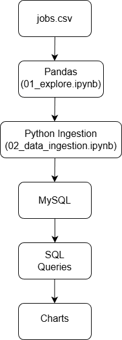

# Job Market & Salary Analytics Platform

## Overview
This project analyzes job market salary data to uncover trends across experience levels,
skills, locations, and remote work roles.

The goal is to demonstrate real-world data analytics skills using Python and SQL.

---

## Tech Stack
- Python (Pandas)
- SQL (MySQL-compatible queries)
- CSV dataset
- Git & GitHub

---

## Project Structure
job-market-salary-analytics/
├── data/
│ └── jobs.csv
├── scripts/
│ ├── 01_explore.py
│ └── 02_data_ingestion.py
├── sql/
│ ├── schema.sql
│ └── analysis_queries.sql
├── docs/
│ └── architecture.png
├── README.md
└── requirements.txt

yaml
Copy code

---

## Workflow
1. Load and explore raw salary data
2. Perform data cleaning and aggregation using Pandas
3. Infer primary skills from job titles
4. Design relational database schema
5. Write business-driven SQL queries
6. Extract insights on salaries and skill demand

---

## Key Insights
- Senior-level roles earn significantly more than entry-level roles
- Machine Learning and Python roles show higher average salaries
- Remote jobs tend to offer better compensation

---

## How to Run
1. Install dependencies:
pip install -r requirements.txt

markdown
Copy code
2. Run exploration:
python scripts/01_explore.py

kotlin
Copy code
3. Run data ingestion:
python scripts/02_data_ingestion.py

sql
Copy code
4. Execute SQL queries from:
sql/analysis_queries.sql

yaml
Copy code

---

## Architecture

## Author
SARAN S